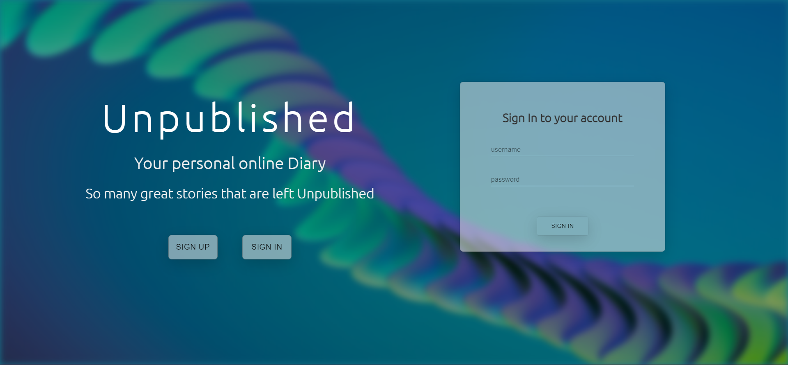
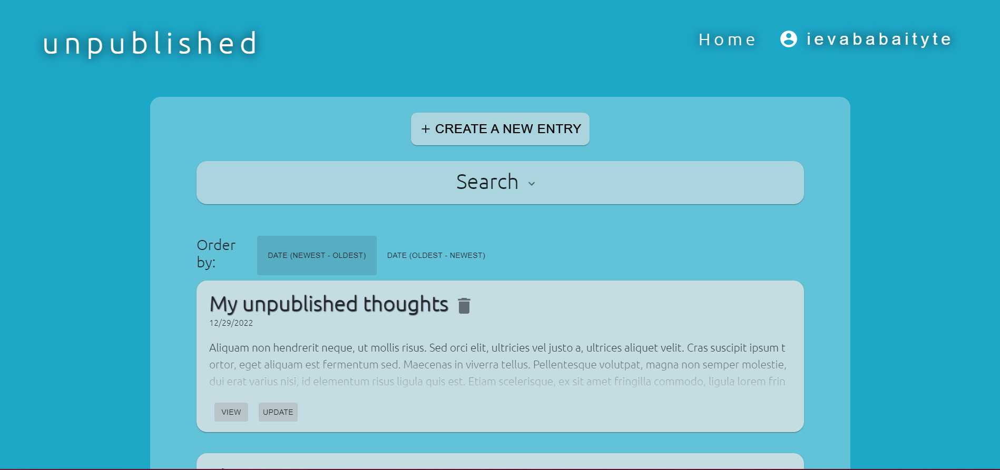

# Unpublished
A diary/journaling application where users can write down their thoughts.

## Features
This app has basic CRUD operations, so while using this app users can:
* Create an account
* Sign in to their account
* Delete their account
* Create an entry
* Delete an entry
* Update an entry
* Specify ordering of entry list
* Search entries

## Screenshots



## Technologies
Project is created with:
* Node.js
* Express
* MongoDB
* Bcrypt
* Jsonwebtoken
* React
* React-router
* Axios
* Material-ui

## Setup
1. Clone repository:
```
git clone https://github.com/ibabaityte/Unpublished.git
```
### Install server:
2. Get in the api folder:
```
cd api
```
3. Install dependencies:
```
npm i
```
4. Start server:
```
npm start
```

### Install client
5. Get in the client folder:
```
cd client
```
6. Install dependencies:
```
npm i
```
7. Start server:
```
npm start
```
